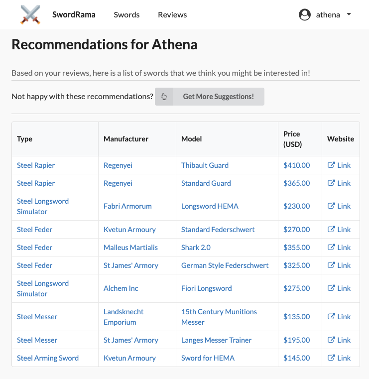
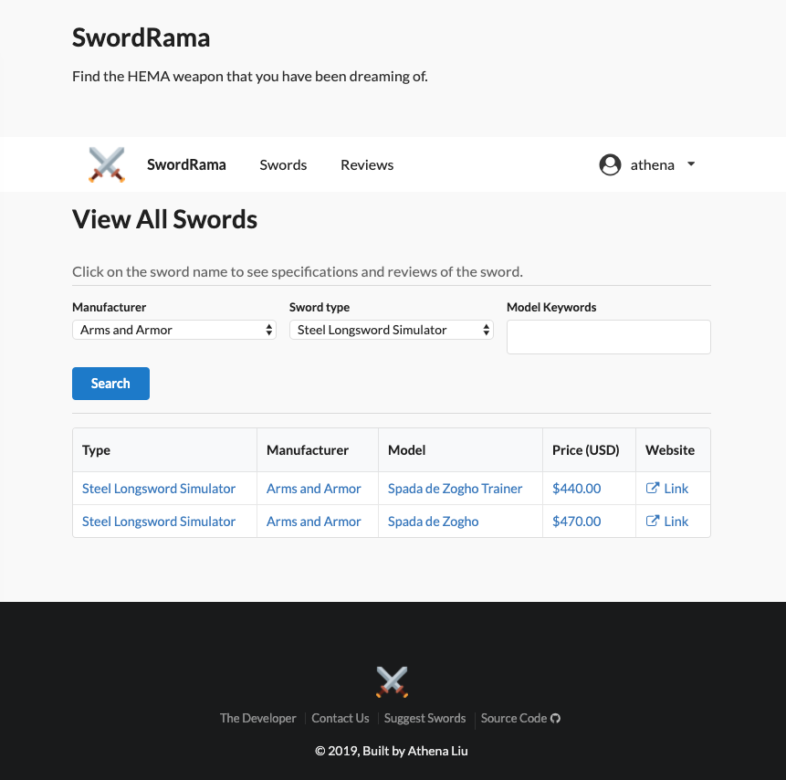
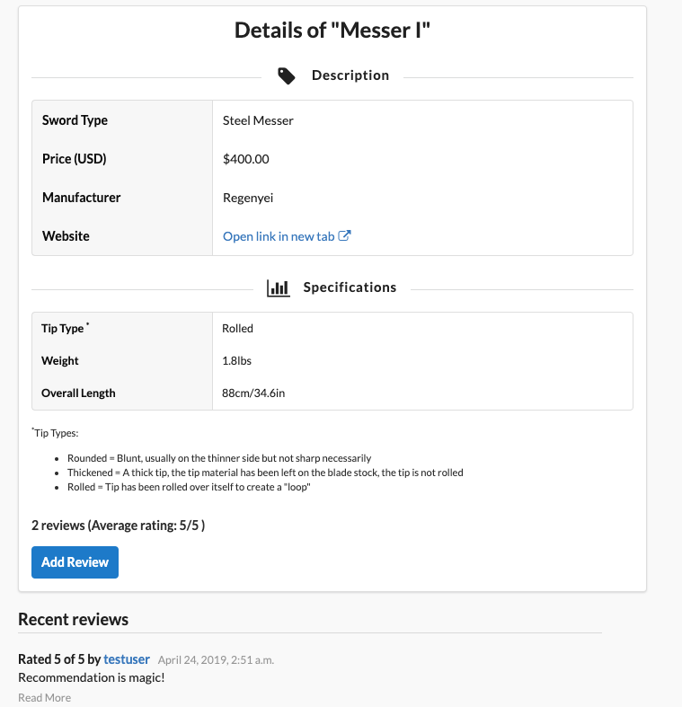

# ⚔️ SwordRama: HEMA Weapon Recommender

[SwordRama](https://swordrama.herokuapp.com/) is a forum platform and a recommendation system to share information and get insights on HEMA (Historical European Martial Arts) weapons such as longsword, rapier and sidesword.

## Motivation

As a HEMA practitioner, it is not always a easy job to find a suited weapon. Manufacturers, sword specifications, price, shipping... There is a lot to research before you can make that order.

We hope to make the process easier by building this sword-review platform. We have created a curated sword list based on the <a href="https://docs.google.com/spreadsheets/d/1kLx0TxPBRav6yG81fVNegE-rBqfEAWYZpYOM6ODy2CQ/edit?fbclid=IwAR0buAckmWs_XJPZHiQvpymbV9VNmXeCm-nr8XqgiqeCrwccJ8rGNSUzTuY">HEMA
Weapon Spreadsheet</a> maintained by <a href="https://www.aidanblake.com/">Aidan
Blake</a> et al. Feel free to view these swords along with other people's reviews and ratings, and more
importantly - add
your own comments!

This is a growing list. If you find a sword that is not on our catalog, please contact us and suggest new swords.

## Machine Learning-based Recommendations

Registered users will get a personalized sword recommendation list based on machine learning. We use K-means clustering as a machine learning model that makes use of user similarity in order to provide the recommendations. The recommendation system is built using Python technologies such as Pandas, SciPy, and Scikit-learn.

## Full Featured Django Application

SwordRama is built with Django, which powers it to have the following features:

- Relational data models including swords, reviews, users and user clusters (for the recommendation system).
- Search sword by keywords, or filter swords by type or manufacturer.
- Full CRUD features for reviews: users can create new reviews, read reviews, update or delete their own reviews.
- View reviews by user.
- Pagination for all sword list and filtered sword list.
- User registration, login & logout system.
- Reset password through email if password is forgotten.
- Users can view and update their profile.
- Customized admin page at [/admin](https://swordrama.herokuapp.com/admin/).
- Get personalized recommendations based on machine learning algorithm.
- Deployed to Heroku.

## Screenshots

Sword Recommendation:

Sword List & Filter & Search:

Sword Details Page:

Build by <a href="https://athena-liu.netlify.com/">Athena Liu</a>

